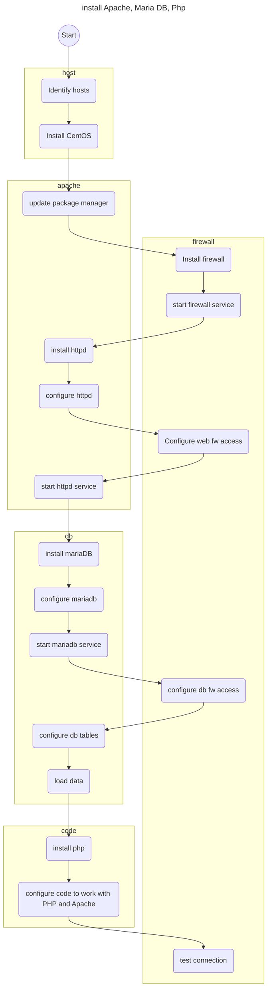

# ansible project

```mermaid
---
title: install Apache, Maria DB, Php
---
flowchart TD

	subgraph host
	host_task1(Identify hosts)
	host_task2(Install CentOS)
	end

	subgraph apache
	srv_task1(update package manager)
	srv_task2(install httpd)
	srv_task3(configure httpd)
	srv_task4(start httpd service)
	end

	subgraph firewall
	fw_task1(Install firewall)
	fw_task2(start firewall service)
	fw_task3(Configure web fw access)
	fw_task4(configure db fw access)
	fw_task5(test connection)
	end

	subgraph db
	db_task1(install mariaDB)
	db_task2(configure mariadb)
	db_task3(start mariadb service)
	db_task4(configure db tables)
	db_task5(load data)
	end

	subgraph code
	code_task1(install php)
	code_task2(configure code to work with PHP and Apache)
	end

	begin((Start))
	--> host_task1 --> host_task2
	--> srv_task1 --> fw_task1
	--> fw_task2 --> srv_task2
	--> srv_task3 --> fw_task3
	--> srv_task4 --> db_task1
	--> db_task2 --> db_task3
	--> fw_task4 --> db_task4
	--> db_task5 --> code_task1
	--> code_task2 --> fw_task5
```